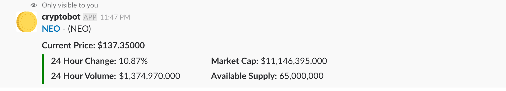
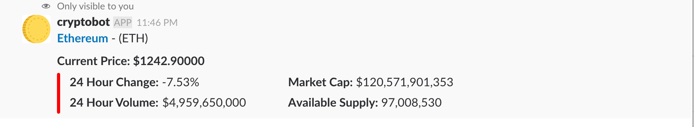
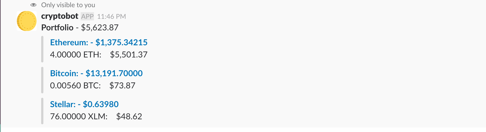
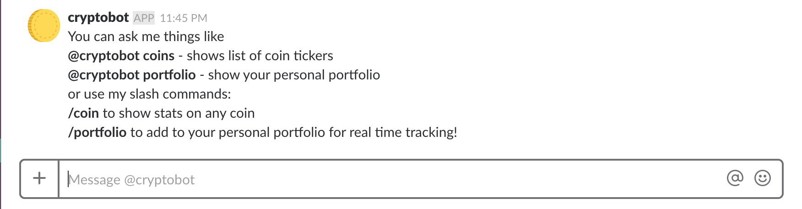

# crypto-bot
Crypto currency slackbot for getting info and storing your own portfolio

### Installation

<a href="https://slack.com/oauth/authorize?client_id=96216496371.297528272727&scope=incoming-webhook,commands,bot,chat:write:bot"></a>

## Functions

This slackbot gives you the ability to view current data on all coins, as well as maintain your own personal crypto portfolio.

 - Query the status of a coin to get all current information using slash commands
 - Add to and view your own portfolio
 - List all coins and their tickers
 - Ability to interact with the bot via slash commans, @mentions, or direct messages with the bot
 
 
## Examples
 
#### Single coin
 ```
/coin [ticker]
 ```

###### Positive


###### Negative


#### Portfolio
 ```
/Portfolio [ticker] [amount]
 ``` 
 
 To add/alter portfolio and then view it
 
 Or
 
 ```
@cryptobot portfolio
 ``` 
 
 To just view it
 


#### All coins
 ```
@cryptobot coins
 ``` 
 
 or DM bot directly
 


#### Help
 ```
@cryptobot help
 ``` 
 
 or DM bot directly
 


### Prerequisites

All requirements are in the requirements.txt file

```
pip install -r requirements.txt
```


